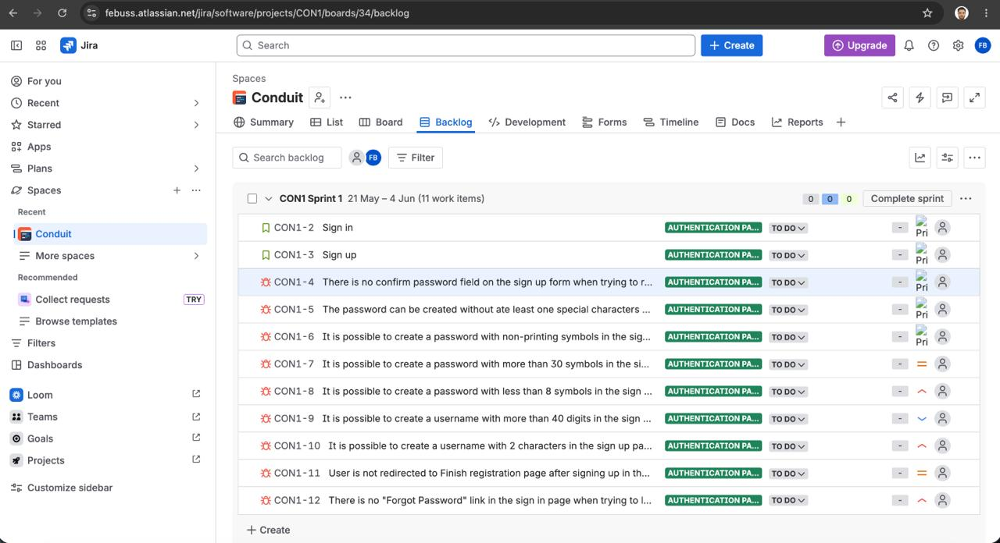
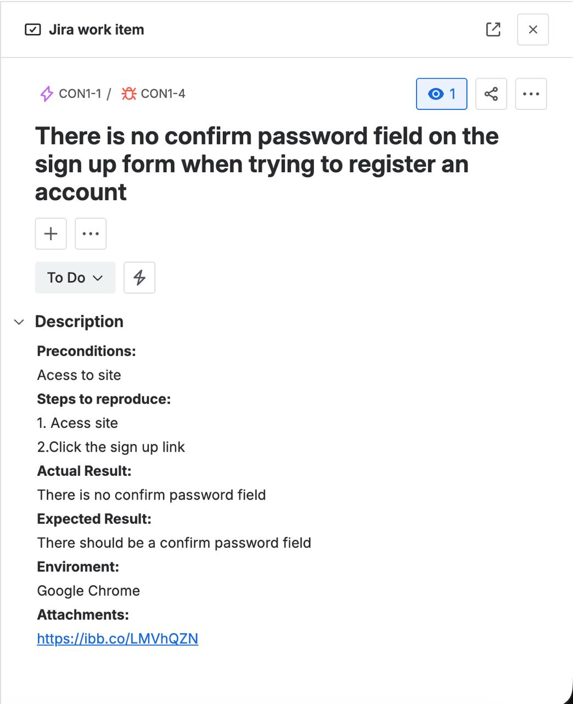
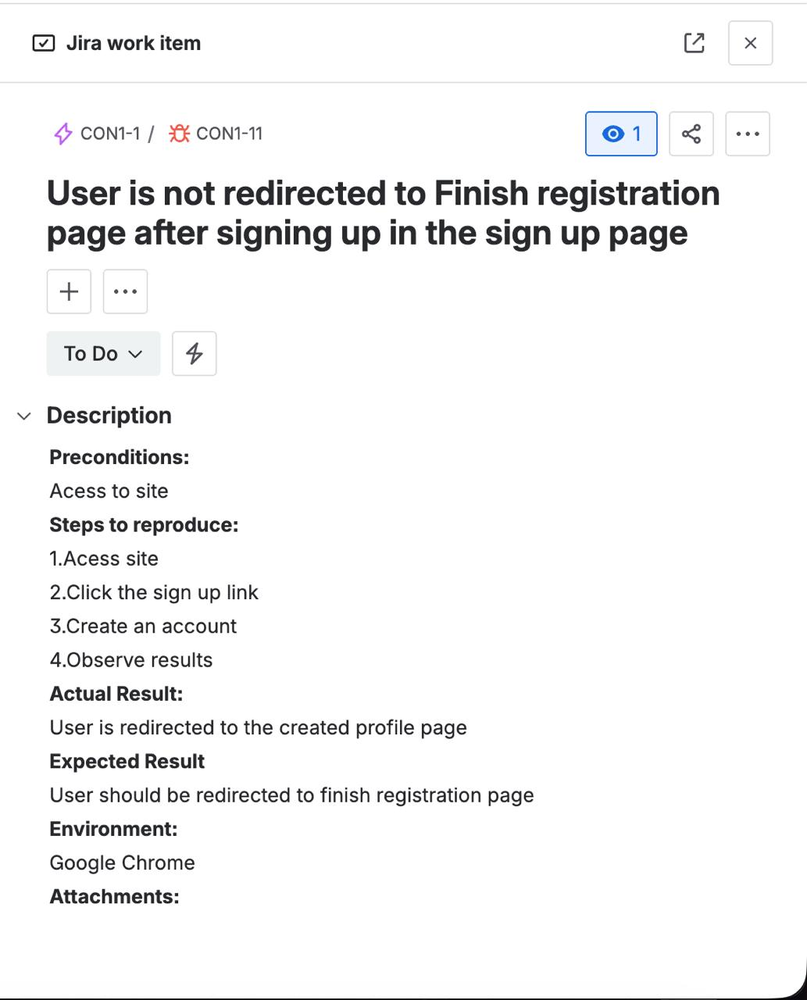

# Jira Agile Management: Conduit Backlog & Bug Tracking

**Context:** This document demonstrates my workflow using Jira for tracking defects and managing Agile tasks. It highlights the visual organization of the Sprint backlog and provides detailed, real-world examples of how I document bug reports within the platform to ensure clear communication with the development team.

---

## 1. Sprint Backlog Overview (Authentication Epic)

The image below illustrates the Sprint 1 backlog, focusing on user authentication stories and their associated defect tickets. 

### Ticket Inventory
| Key | Type | Summary | Status |
|:---|:---:|:---|:---:|
| **CON1-2** | Story | Sign in | TO DO |
| **CON1-3** | Story | Sign up | TO DO |
| **CON1-4** | Bug | There is no confirm password field on the sign up form... | TO DO |
| **CON1-5** | Bug | The password can be created without at least one special character... | TO DO |
| **CON1-6** | Bug | It is possible to create a password with non-printing symbols... | TO DO |
| **CON1-7** | Bug | It is possible to create a password with more than 30 symbols... | TO DO |
| **CON1-8** | Bug | It is possible to create a password with less than 8 symbols... | TO DO |
| **CON1-9** | Bug | It is possible to create a username with more than 40 digits... | TO DO |
| **CON1-10** | Bug | It is possible to create a username with 2 characters... | TO DO |
| **CON1-11** | Bug | User is not redirected to Finish registration page after signing up... | TO DO |
| **CON1-12** | Bug | There is no "Forgot Password" link in the sign in page... | TO DO |

---

## 2. Bug Reporting Standards (Ticket Drill-Down)

To demonstrate the level of detail documented inside each Jira issue, below are full visual extractions and text transcriptions of critical bugs from the backlog. I ensure every bug report contains clear reproduction steps, expected versus actual results, and environment parameters.

### 🐛 Ticket CON1-4: Missing Confirm Password Field

*(Below is the internal view of the Jira ticket demonstrating the reporting structure)*

**Text Transcription:**
> **Description:**
> During the registration process on the Sign Up page, the required "Confirm Password" field is completely missing from the user interface. This prevents the user from verifying their typed password, which violates the security requirements established in the PRD.
> 
> **Steps to Reproduce:**
> 1. Navigate to the Conduit web application.
> 2. Click on the "Sign up" link in the navigation bar.
> 3. Observe the input fields provided in the registration form.
> 
> **Expected Result:**
> The form should display a "Confirm Password" field directly below the "Password" field to ensure input accuracy.
> 
> **Actual Result:**
> Only the Username, Email, and Password fields are displayed.
> 
> **Environment:** macOS / Chrome (latest)

---

### 🐛 Ticket CON1-11: No Redirection After Successful Sign Up

*(Below is the internal view of the Jira ticket demonstrating the reporting structure)*

**Text Transcription:**
> **Description:**
> When a user successfully creates a new account using valid credentials, the system authenticates the user but fails to redirect them to the "Finish Registration" page as specified by the application's flow.
> 
> **Steps to Reproduce:**
> 1. Navigate to the Sign Up page.
> 2. Fill in the Username, Email, and Password fields with valid data.
> 3. Click the [Sign up] button.
> 4. Observe the post-submission behavior.
> 
> **Expected Result:**
> The system should immediately redirect the user to the "Finish Registration" page.
> 
> **Actual Result:**
> The user remains on the Sign Up page, although the account is successfully created in the backend.
> 
> **Environment:** macOS / Google Chrome